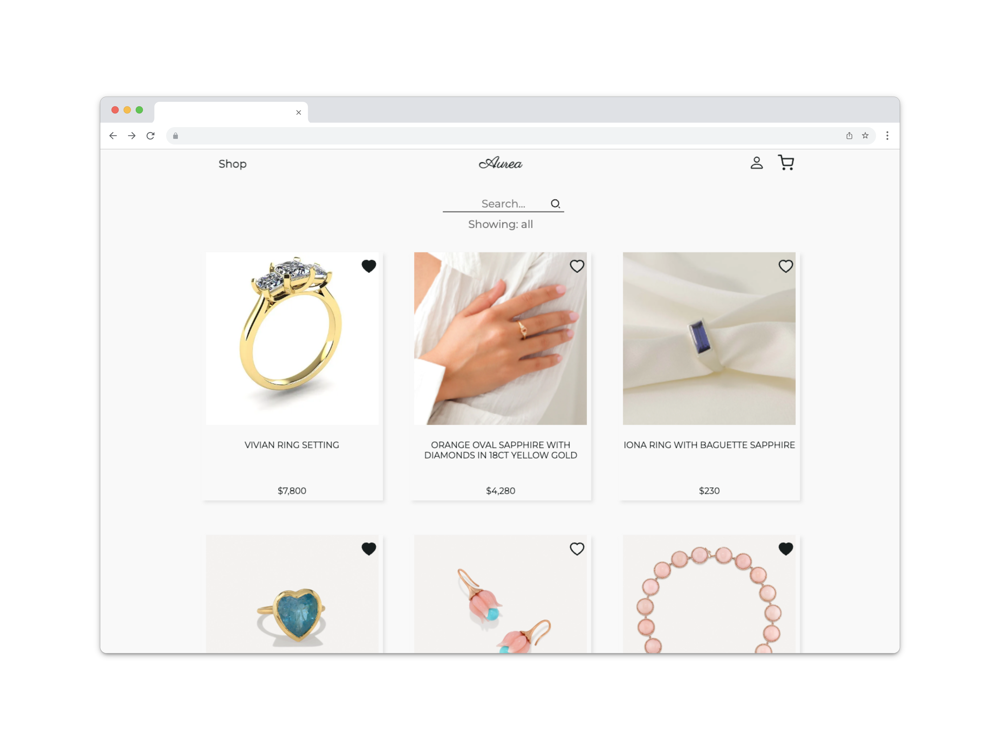
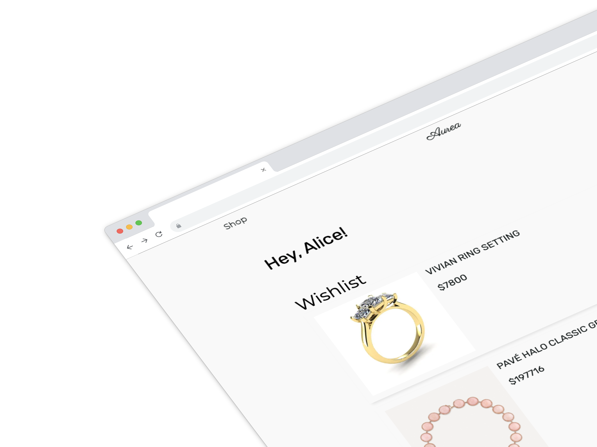
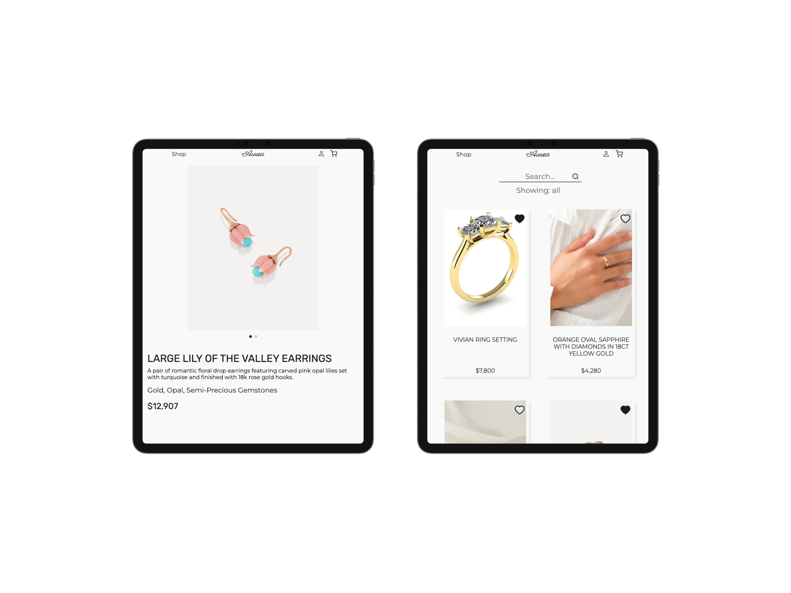

# Full-stack development Team Project - Aurea

> Project Mockup







> Project Description

Aurea is a global online marketplace, where people come together to make, sell, buy and collect unique jewelry.
As sellers, it’s a struggle to build your own platform and gain a target audience. Therefore using a third party platform such as Aurea has a large and established user base. Meaning the sellers can reach a wide audience of potential customers without the need for extensive marketing efforts.

> Dependencies

- nodemon : A development tool that monitors changes in Node.js application.(restarts the server when code changes are detected)
- bcrypt: A library for hashing and salting passwords.(securely storing user passwords in databases)
- cors: CORS middleware allows us to control which domains can access backend API.
- dotenv: dotenv loads environment variables from a .env file.
- express: Node.js framework for building web applications and APIs.(routing, middleware handling, request/response processing)
- googleapis: interacting with Google Drive API in backend.
- jsonwebtoken: Generating and verifying JSON Web Tokens (JWTs).
- mongoose: An Object Data Modeling (ODM) library for MongoDB. It simplifies working with MongoDB databases.
- validator: Validate and sanitize user input.
- axios: A JS library for making HTTP requests.
- bootstrap-icons: A collection of icons
- date-fns: A library for working with dates.
- react: A JavaScript library for building user interfaces.
- react-dom: A package for rendering React components into the DOM.
- react-icons: A set of popular icon libraries as React components.
- react-loader-spinner: This library offers various loading spinners and animations.
- react-router-dom: A library for handling routing and navigation in React applications.
- swiper: Touch slider library.

> Code snippets

- This userSchema allows for the display of individual carts and wishlists for each user.

```javascript
const mongoose = require("mongoose");
const bcrypt = require("bcrypt");
const validator = require("validator");

const Schema = mongoose.Schema;

const userSchema = new Schema({
  username: {
    type: String,
    required: true,
    unique: true,
  },
  email: {
    type: String,
    required: true,
    unique: true,
    validate: {
      validator: validator.isEmail,
      message: "Please enter a valid email",
    },
  },
  password: {
    type: String,
    required: true,
    validate: {
      validator: (value) => validator.isStrongPassword(value, { minLength: 8 }),
      message: "Please enter a stronger password",
    },
  },
  isvendor: {
    type: String,
    required: true,
  },
  wishlists: [
    {
      type: Schema.Types.ObjectId,
      ref: "Product",
    },
  ],
  carts: [
    {
      type: Schema.Types.ObjectId,
      ref: "Product",
    },
  ],
});
```

#

- Create component for an individual product card
- Add to wishlist by clicking heart-icon in the individual product
- Icon change based on status of isInWishlist

```javascript
const ProductCard = ({ product }) => {
  const { addToWishlist, removeFromWishlist, wishlist } = useWishlist();
  const icons = useIcons();
  const [isHovered, setIsHovered] = useState(false);
  const [isInWishlist, setIsInWishlist] = useState(false);

  useEffect(() => {
    const wishlistIds = wishlist.map((item) => item._id); // Extract product IDs from the wishlist
    setIsInWishlist(wishlistIds.includes(product._id)); // Check if the product ID is in the wishlist IDs
  }, [wishlist, product]);

  const handleMouseEnter = () => {
    setIsHovered(true);
  };

  const handleMouseLeave = () => {
    setIsHovered(false);
  };

  const handleHeartClick = () => {
    if (isInWishlist) {
      removeFromWishlist(product._id);
    } else {
      addToWishlist(product._id);
    }
    setIsInWishlist(!isInWishlist);
  };

  return (
    <div
      className="product-card"
      onMouseEnter={handleMouseEnter}
      onMouseLeave={handleMouseLeave}
    >
      <React.Suspense fallback={<div>Loading Icons...</div>}>
        {isInWishlist ? (
          <icons.HeartFilledIcon
            className="heart-icon"
            onClick={handleHeartClick}
          />
        ) : (
          <div>
            <icons.HeartFilledIcon
              className="heart-icon heart-icon-fill-unclicked"
              onClick={handleHeartClick}
            />
            <icons.HeartIcon
              className="heart-icon"
              onClick={handleHeartClick}
            />
          </div>
        )}
      </React.Suspense>
      <Link to={`/product/${product._id}`} key={product._id}>
        <div className="image-container">
          
        </div>
        <div className="text-container">
          <div className="product-name">{product.title}</div>
          <div className="product-description">{product.description}</div>
          <div className="product-material">{product.materials}</div>
          <div className="product-price">${product.price}</div>
        </div>
      </Link>
    </div>
  );
};
```

> Developed by

### Alice Kim, Annika Valladolid, Deepak Joshi, Ethan Jones, Yasser Saeed
